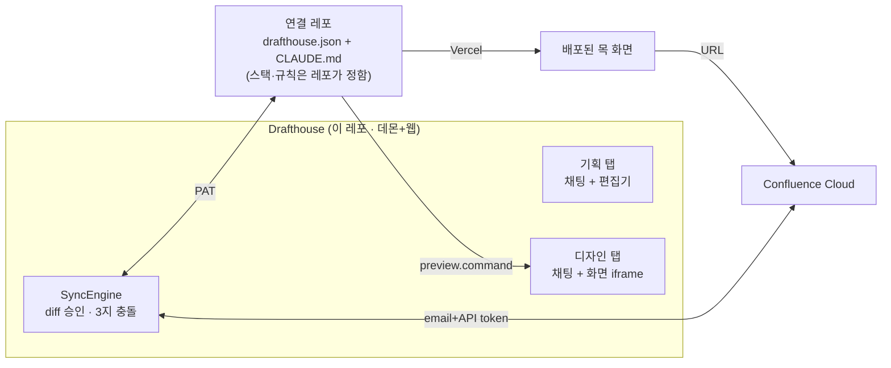

# Drafthouse — 기획·디자인 도구 설계 (통합본)

## 1. 목적

조직 워크플로우 **기획 → 디자인 → 개발 → QA** 중 앞의 두 단계를, 기획자가 git·Confluence 편집기·터미널 없이 수행하게 한다.

- 기획자는 채팅으로 Claude Code를 부려 기획서를 쓰거나 **직접 편집**하고, 그 기획서로 **연결된 레포가 정한 방식**으로 목 화면을 만들고, **실제 렌더된 화면**을 보며 기획을 검증한다.
- 산출물은 그림이 아니라 실제 동작하는 코드 + `HANDOFF.md`. 무엇을 import하고 어떤 규칙을 지키는지는 레포가 정한다. 개발자는 폴더를 복사해 mock 데이터 파일만 바꾼다.
- 게시된 화면은 배포되어 URL로 공유되고, 기획서에서 링크된다. QA도 같은 URL을 본다.

## 2. 원칙

**도구는 도메인을 모른다.** 도구가 아는 것은 "로컬 폴더 ↔ 원격을 동기화하고, 그 폴더에서 Claude Code를 채팅으로 돌린다"뿐. 디자인 시스템·화면 규칙·검사·빌드·프리뷰는 전부 **연결된 레포**가 `drafthouse.json`과 `CLAUDE.md`로 정의한다. 기획서 저장 형식(Confluence 미러)만 도구 도메인.

이 문서에서 `@colosseumcoinckr/cds`·React/Next.js·Vercel은 **첫 연결 레포(§5)의 선택**이다. 도구는 레포가 React든 Next.js든 구분하지 않는다: `drafthouse.json`의 `preview.command`를 레포 폴더에서 실행하고, `preview.port`가 열리면 그 주소를 `<iframe>`에 넣는다. 그 안에 무엇이 보이는지(피커·화면·상태 선택·프레임)는 전부 레포의 프리뷰 앱이 렌더하며 도구는 내용을 파싱하지 않는다. 사내 프로젝트가 모두 Next.js라 첫 레포는 Next.js로 가지만, 순수 React(Vite) 레포도 같은 계약으로 연결된다.



## 3. 두 탭

| | 기획 탭 | 디자인 탭 |
|---|---|---|
| 로컬 폴더 | Confluence 스페이스 미러 `~/drafthouse/confluence/<space>/` | 연결 레포 clone `~/drafthouse/repo/` |
| Claude cwd | 미러 폴더 (도구 제공 CLAUDE.md: 문서 형식 규칙) | 레포 clone + 미러를 `--add-dir`로 읽기 참조 |
| 규칙 출처 | 도구 | 레포의 `CLAUDE.md` · skills · `.claude/settings.json` |
| 사람의 직접 작업 | **WYSIWYG 편집기** | **요소 클릭 코멘트** |
| 가져오기 | 자동 백그라운드 pull (편집·세션 중 연기) | 세션 시작 시 pull |
| 반영 | diff 승인 → Confluence push | diff 승인 → `check`+`build` 게이트 → commit → push |
| 충돌 | 내 것으로 덮기 / 원격 받기 / diff 보고 직접 처리 | 동일 |
| 오른쪽 패널 | 편집기(= 미리보기) + Confluence 웹 링크 | 레포 `preview` dev 서버 iframe — 레포가 렌더하는 실제 화면 |

두 탭은 같은 SyncEngine·DiffReview 위에 어댑터 둘(Confluence, Git). 기획자는 어느 원격도 직접 열지 않는다. **저자가 사람이든 Claude든 반영 경로는 하나.**

**기획서 ↔ 화면 연결**: 도구는 기억하지 않는다. 레포 CLAUDE.md가 "`@confluence/<space>/<page>.md`를 기획서로 삼고 `HANDOFF.md`에 페이지 URL·검토 버전을 남겨라"고 지시하고, 기획 탭 Claude가 배포 URL을 기획서에 삽입한다. 링크는 문서 안에 살고 도구엔 상태가 없다.

## 4. 기획 탭

### 4.1 화면

```
┌ 스페이스/페이지 트리 ┬ 채팅 (Claude Code) ┬ 문서 편집기 ─────────────┐
│ 스페이스 A          │                    │ [편집] [원문] [Confluence↗] │
│  ├ 페이지 1         │                    │                            │
│  ├ 페이지 2 ●수정됨 │                    │  WYSIWYG 본문              │
│ 스페이스 B          │                    │  ┌ Confluence 요소: toc ┐  │
│                     │                    │  └ (편집 불가 · 이동만) ┘  │
│                     │ [선택 → 채팅에 인용] │  [diff 보기] [Confluence 반영] │
└─────────────────────┴────────────────────┴────────────────────────────┘
```

### 4.2 Confluence 동기화

- **형식**: Markdown 본문 + YAML frontmatter(`pageId` `version` `space` `title`) + Markdown으로 못 담는 요소(매크로·병합 셀·레이아웃)는 원본 storage XML을 ` ```confluence ` 펜스로 보존. **무손실 왕복이 핵심 테스트**(pull → 저장 → push 후 구조·첨부 유지; 편집기 경유도 동일)
- **범위**: 단일 사이트, 다중 스페이스(독립 폴더·동기화 상태), 스페이스 전체 복제, 첨부 다운로드·업로드·교체, 페이지 편집·생성. 삭제 없음
- **버전**: Confluence PUT `version.number+1` 낙관적 잠금. 원격 버전 ≠ 기록 버전이면 push 차단 → 3지 선택
- **인증**: 이메일 + API 토큰, OS 자격 증명 저장소(Keychain / Credential Manager)

### 4.3 편집기

- **TipTap(ProseMirror) + Markdown 직렬화.** WYSIWYG 기본, "원문" 토글
- frontmatter 숨김(제목만 필드로). 보존 블록은 **원자 노드**: 회색 카드 "Confluence 요소 · 매크로 toc", 내부 편집 불가, 이동·삭제만
- 지원 부분집합: 제목·단락·목록·표·코드·링크·이미지. 이미지 붙여넣기 → 첨부 폴더 → push 시 첨부 업로드. 이 부분집합을 CLAUDE.md에도 명시해 Claude가 그 밖을 쓰지 않게
- **저장 시 정규화**: 저장 경로 하나(remark-stringify 규칙 고정)를 편집기·Claude 양쪽에 강제 → diff에 서식 잡음 없음
- **선택 → 채팅 인용**: 본문 드래그 → 컴포저에 인용 첨부(페이지·헤딩 경로·선택 텍스트)

### 4.4 한 파일, 두 저자 — 턴 기반 배제

| 상태 | 편집기 | Claude |
|---|---|---|
| Claude 턴 실행 중 | 읽기 전용(사유 표시), 변경 실시간 반영 | 쓰기 |
| 기획자 편집 중 | 쓰기, 디바운스 자동 저장(~500ms) | 전송 비활성 → 저장 후 활성 |
| 자동 pull | 미저장 변경·Claude 턴 중이면 연기 | — |

디스크 파일이 유일한 진실. 데몬이 미러 폴더를 감시해 편집기·Claude 양쪽에 전달. 병합·CRDT 없음.

## 5. 디자인 탭 — 첫 연결 레포 (개인 GitHub에 신설)

도구가 요구하는 것은 루트 `drafthouse.json` 하나. 그 밖의 모든 것(스택·디자인 시스템·규칙·검사)은 레포의 결정이다. 아래는 **첫 레포의 결정**: 현 `templates/cds-mock`(React + Vite)을 **Next.js** + `@colosseumcoinckr/cds`로 재구성 — 사내 프로젝트가 모두 Next.js라 개발자가 폴더를 그대로 옮길 수 있게. `registry`는 private 패키지가 있을 때만 필요한 선택 항목.

```json
{
  "install": "pnpm install",
  "check":   "pnpm check",
  "build":   "pnpm build",
  "preview": { "command": "pnpm dev", "port": 5274 },
  "registry": { "host": "npm.pkg.github.com", "scope": "@colosseumcoinckr" }
}
```

```
drafthouse.json
CLAUDE.md                       # (레포 결정) CDS만 사용, 폴더 격리, mock 분리, HANDOFF, 기획서 참조 규칙
.claude/settings.json           # acceptEdits, pnpm check 허용
.claude/skills/cds/             # (레포 결정) 컴포넌트·토큰 카탈로그
.claude/skills/screen-mock/     # 화면 작성 절차
scripts/check-screens.mjs       # 타 feature import·하드코딩 색상·미정의 토큰·인라인 데이터 거부
app/layout.tsx                  # 관리자 셸 프레임(stand-in)
app/page.tsx                    # 화면 피커 (feature · screen · state) — 레포가 스스로 렌더
app/[feature]/[screen]/page.tsx # ?state= 로 변형 선택
src/screens/<feature>/
  X.screen.tsx                  # CDS만, react · @colosseumcoinckr/* · 옆 파일만 import
  X.mock.ts                     # 개발자 교체 지점
  HANDOFF.md                    # 화면·컴포넌트·미결 질문·Confluence URL/버전
src/preview-bridge/             # 코멘트 오버레이 (dev 전용)
```

- `check` = 규칙, `build`(`next build`) = 컴파일. 둘 다 게시 전 로컬 게이트. 실패 출력은 Claude에게 → 수정 → 재게시
- 배포: Vercel. `installCommand`에서 secret으로 `~/.npmrc` 작성 후 설치. **Deployment Protection 필수**(사내 DS 코드가 번들에 포함)
- URL 규칙 `/<feature>/<screen>?state=<state>` 고정 → 호스팅 교체에도 기획서 링크 유효
- 연결 레포가 전용 mock 레포든 제품 레포든 도구 코드는 같음

## 6. 코멘트 → 수정 (요소 클릭 도구)

웹(5273)과 프리뷰(5274)는 다른 오리진 → 오버레이는 **레포 프리뷰 앱 안**에, 도구와는 `postMessage` 계약으로만 통신.

- 오버레이(dev 전용): 코멘트 모드 → 호버 하이라이트 → 클릭 핀 + 입력. 요소 식별은 React fiber의 컴포넌트 이름, `data-screen`·`data-state`, DOM 경로, 텍스트, bbox. 소스맵 불필요
- 계약(이 레포 protocol):
  ```ts
  { type: "drafthouse.comment", screen: "member/MemberList", state: "empty",
    element: { component: "Button", text: "저장", path: "…", rect: {…} },
    comment: "버튼이 너무 커요. 보조 버튼으로" }
  ```
- 도구: 핀 여러 개 → "수정 요청 N건" 구조화 첨부 → 전송 → Claude 수정 → 핫 리로드 → 핀 해제
- v1: 클릭·코멘트·전송. 스크린샷 크롭·화살표는 후순위

## 7. 프로그램 형태 — 설치형 데스크톱 앱 (Windows · macOS)

기획자는 설치 파일 하나를 받아 실행한다. 터미널·Node·pnpm 설치는 요구하지 않는다.

- **Electron**으로 패키징. 현 데몬(Node)은 Electron 메인 프로세스에서 그대로 돌고, 현 웹 UI는 렌더러가 된다. 데몬↔웹 WebSocket 프로토콜은 유지 → 브라우저로 붙는 개발자 경로와 테스트가 그대로 살아남
- Tauri는 Node 데몬을 사이드카로 따로 묶어야 해서 이점이 없음
- **런타임 번들**: 연결 레포의 `install`·`preview`·`build`가 Node·pnpm을 요구하므로 앱 리소스에 포터블 Node + corepack을 넣고 레포 명령 실행 시 PATH 앞에 붙인다. 사용자 머신의 Node와 무관
- **외부 전제 두 개만 남음**, 앱이 감지하고 안내·실행한다
  - Claude Code CLI: 미설치면 네이티브 설치 스크립트를 앱이 실행, 미로그인이면 `claude /login`을 앱 안에서 띄움. 구독은 사용자 것
  - git: macOS는 Xcode CLT 설치 프롬프트 유도, Windows는 MinGit을 앱에 번들
- **배포**: 서명·공증 없음(사내 배포). **GitHub Releases** — 소스 없이 설치 파일만 올리는 **공개 releases 전용 레포**. 공개여야 GitHub 계정 없는 기획자도 링크로 받고, 인앱 업데이트 확인이 토큰 없이 동작한다. 계정·링크 접근이 어려운 사람에게는 설치 파일을 직접 공유
  - macOS: 미서명 앱은 첫 실행 시 Gatekeeper가 막음 → 설치 안내 페이지에 "시스템 설정 → 개인정보 보호 및 보안 → 그대로 열기" 한 번을 명시. Apple Silicon은 서명 없는 바이너리가 실행 자체가 안 되므로 electron-builder의 **ad-hoc 서명**은 켠다(인증서 불필요)
  - Windows: NSIS 설치 파일. SmartScreen "추가 정보 → 실행" 한 번을 안내
- **업데이트: 수동만(v1)**. 설정의 "업데이트 확인" 버튼 → Releases의 `latest.json`과 현재 버전 비교 → 새 버전이면 변경 내용 + "다운로드 후 설치" 버튼. 백그라운드 확인·자동 다운로드 없음
  - Windows: `electron-updater` 수동 모드(`autoDownload: false`) — 버튼으로 다운로드 → 종료 후 설치
  - macOS: `electron-updater`는 미서명 앱을 갱신하지 못함(Squirrel.Mac 제약) → zip 다운로드·sha256 검증 → 종료 시 `/Applications/Drafthouse.app` 교체 → 재실행을 앱이 직접 수행. 앱이 내려받은 파일엔 quarantine이 붙지 않아 Gatekeeper 재승인 없음
  - 자동 확인은 같은 코드에 타이머만 얹으면 되므로 후순위로 미룸
- **자격 증명**: PAT·Confluence 토큰은 Electron `safeStorage`(Keychain / DPAPI). 렌더러로 가지 않음
- 데몬 포트·페어링 토큰은 앱 내부 구현으로 숨겨짐. 연결 화면 없음

## 8. 설정 / 온보딩

첫 실행 시 아래를 순서대로 통과해야 탭이 열린다. 각 단계는 실패 원인을 한국어로 보이고 고칠 버튼을 준다.

| 항목 | 입력 | 검증 |
|---|---|---|
| Claude Code | 자동 탐지 / 설치·로그인 실행 | 경로·로그인·API 키 섀도잉 |
| git | 자동 탐지 / 설치 유도(mac) · 번들(win) | `git --version` |
| 연결 레포 | URL + PAT | clone·push 권한·`drafthouse.json`·`install` 성공(레지스트리 인증은 앱이 PAT로 작성) |
| Confluence | 사이트 URL + 이메일 + API 토큰 + 스페이스 선택 | `GET /wiki/api/v2/spaces` 200 → 초기 복제 |

터미널 명령 안내는 없음. 현 `pnpm doctor`가 이 화면의 백엔드가 된다.

## 9. 이 레포 변경

| 영역 | 변경 |
|---|---|
| `templates/cds-mock` | 연결 레포로 이전 후 삭제 |
| `daemon/mock.ts` | 템플릿 복사·해시·`meta` 스캔·화면 감시 제거 → clone/pull/push + `drafthouse.json` 명령 실행 |
| `daemon` 신규 | `sync/`(SyncEngine, Confluence·Git 어댑터), storage↔하이브리드 md 변환기, 첨부, 자격 증명 저장, 미러 감시→편집기 푸시, 저장 API(정규화), Claude 쓰기 후 정규화 훅, 코멘트 첨부 조립 |
| `protocol` | `settings.*` `confluence.*` `repo.*` `diff.*` `doc.open/save/changed/lock` 충돌 선택, 코멘트·인용 첨부. `screens` 삭제 |
| `web` | 탭 2개, 페이지 트리, TipTap 편집기·원자 노드·잠금, diff 승인, 충돌 3지, 온보딩, 코멘트 수신 |
| `desktop` 신규 | Electron 메인(데몬 호스팅·safeStorage·수동 업데이트·포터블 Node/pnpm/MinGit 번들·CLI 설치 실행), electron-builder 설정, 릴리스 피드 생성 CI |
| 테스트 | `test:mock` → 픽스처 레포. `test:confluence` = 골든 패스 + 무손실 왕복(편집기 경유 포함) + 직접 편집→diff→반영. `test:planner` → 레포 계약 기준 |
| 문서 | README·PLAN 재작성. confluence app 스펙 흡수: ef-5(편집기 없음) 폐기, AC-8 → 편집기 렌더로 교체 |

## 10. 구현 순서

1. **첫 연결 레포 신설** — `drafthouse.json` + 레포 결정(React/Next.js · CDS · 지침 · 검사 · 피커). `pnpm dev`에서 화면 보이면 완료
2. **레포 계약·clone화** — 템플릿 로직 제거, clone/pull/명령 실행. 디자인 탭이 새 레포로 동작 → **기획자가 실제 화면을 봄**
3. **게시** — diff 승인 → check+build → commit/push. Vercel 연결
4. **Confluence** — 4a 미러·변환기·pull·push·충돌 / 4b 페이지 트리·읽기 렌더 / 4c 편집기 쓰기·잠금·정규화 / 4d 이미지 첨부·선택 인용
5. **온보딩·자격 증명 저장**
6. **코멘트 오버레이 + postMessage 계약**
7. **데스크톱 패키징** — Electron 래핑, 런타임 번들, 설치 안내 페이지, 수동 업데이트(win: electron-updater 수동 모드, mac: 자체 교체). Windows·macOS 각 1대에서 설치→첫 실행→화면까지 확인
8. 문서·테스트 정리

## 11. 리스크와 열린 항목

- 개인 PAT의 조직 패키지 읽기 권한 — 1단계 첫 `pnpm install`에서 판명
- Vercel 플랜(Deployment Protection 가능 여부) — 3단계 전
- TipTap↔Markdown은 부분집합 밖에서 깨짐 → 부분집합 명시 + 편집기 경유 왕복 테스트
- Claude 턴 중 편집기 읽기 전용은 체감됨 → 사유 표시로 흡수
- 첫 스페이스와 신규 페이지 생성 위치 규칙 — 4단계 전
- macOS 미서명: OS 업데이트로 Gatekeeper 우회 절차가 바뀔 수 있음 → 설치 안내 페이지를 릴리스와 함께 관리. 자체 업데이터는 `/Applications` 쓰기 권한이 없는 계정에서 실패 → 그때만 수동 다운로드 안내
- 번들 크기: Electron + 포터블 Node ≈ 200MB대. 내부 배포라 수용
- 레포 `install`이 네이티브 빌드를 요구하면 번들 Node로는 실패할 수 있음 → 첫 레포는 순수 JS 의존성만
