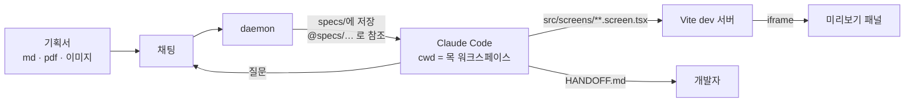

# Agent Hub

Turns a planning document into working screens built from the company design
system, in a chat a planner can use, for internal use.

A planner attaches their document, answers the questions Claude asks about what
the document leaves open, and watches the screens appear in a pane next to the
conversation. What comes out is not a picture: it is React files that import
`@colosseumcoinckr/cds` the same way the real app does, plus a `HANDOFF.md`, so
a developer moves a feature by copying its folder and replacing one mock data
file.

This started as a developer-facing chat with a workspace picker, model and
effort pickers, and raw tool blocks. That half is gone. There is one audience
now, and one workspace: everything a planner does not need was removed rather
than hidden behind a tab, because a control nobody should touch is still a
control someone will.

Each person runs a small daemon on their own machine. The daemon drives the
Claude Code CLI that person already signed in to, and streams the session to a
browser. Nobody's credentials pass through a shared server, and nobody's usage
is paid for on someone else's behalf.

Phase 1 (this repo today) is local only: the daemon listens on `127.0.0.1` and
the browser connects straight to it. Phase 2 adds the relay that lets you reach
your own daemon from another device behind single sign-on. `PLAN.md` holds the
full plan.

## How it works



1. **One mock workspace per machine**, at `~/agent-hub-mocks` (override with
   `AGENT_HUB_MOCK_ROOT`). The daemon creates it from `templates/cds-mock`,
   installs the design system, starts the preview dev server on port 5274
   (`AGENT_HUB_PREVIEW_PORT`), and re-syncs the template's infrastructure on
   every start while leaving `src/screens/` and `specs/` alone.
2. **The document is a file, not a paste.** Attachments are saved under
   `specs/` and mentioned to Claude as `@specs/<name>`, so its Read tool handles
   PDF page ranges and image downscaling, the document stays available to later
   sessions, and `HANDOFF.md` can cite it. `.md .txt .pdf .png .jpg .jpeg
   .webp` are accepted; export a `.docx` to PDF first.
3. **The workspace configures the agent.** `CLAUDE.md`, the `cds` and
   `screen-mock` skills, and `.claude/settings.json` all live in the template,
   so the rules a screen must follow are versioned with the code that checks
   them. Planner sessions run in `acceptEdits`.
4. **`pnpm check` is the gate.** `scripts/check-screens.mjs` rejects an import
   from another feature, a missing `meta`, a hard-coded colour, an invented
   design token, and data left inline instead of in the sibling mock file. It
   names the fix, because the agent is the one reading the failure.
5. **The preview follows the work.** The daemon watches `src/screens`, so a
   screen appears in the picker as soon as it is written, and Vite's hot reload
   shows an edit without a click.

## What a screen looks like

```
src/screens/member/MemberList.screen.tsx   # the screen — CDS components only
src/screens/member/MemberList.mock.ts      # the data — a developer's swap point
src/screens/member/HANDOFF.md              # screens, components, open questions
```

A screen may import `react`, `@colosseumcoinckr/*`, and files beside it —
nothing else, so the folder moves on its own. It renders the content area only:
the preview supplies a stand-in admin shell through `meta.frame`, because the
real app already has navigation of its own. `meta.states` lists the variants it
can render, and the preview offers one per state, which is how an empty or
error screen gets reviewed at all.

## Requirements

Windows and macOS are both supported. Linux works too, on the same code path
as macOS.

- Node 22 or newer, and pnpm 11
- Claude Code CLI installed and signed in (`claude /login`)
- git, for `@` file mentions to respect `.gitignore`. On Windows, Git for
  Windows also gives Claude Code its Bash tool.
- No `ANTHROPIC_API_KEY` in the daemon's environment. If one is set, sessions
  bill that key instead of the subscription, and the daemon says so on startup.
- A GitHub PAT with `read:packages`, stored in the **user-level** npmrc, or the
  mock workspace cannot install the design system:
  `pnpm config set //npm.pkg.github.com/:_authToken <PAT>`. A token written into
  a repository `.npmrc` does not work — pnpm 11 does not expand `${ENV_VAR}`
  there. `pnpm doctor` reports whether this machine can reach the registry.

The daemon finds the CLI wherever each platform's installer puts it: the native
installer's `~/.local/bin` on all three, plus Homebrew on macOS and WinGet on
Windows. Set `AGENT_HUB_CLAUDE_BIN` to override.

The daemon marks the mock workspace as trusted in `~/.claude.json` the first
time it prepares it. Claude Code silently drops every `permissions.allow` entry
from a project it has not been trusted, and the trust dialog is interactive, so
without this a planner would answer an approval card for each `pnpm check`. It
is the daemon's own generated directory, so nothing is being accepted on the
user's behalf that they did not ask for.

## Run it

The commands are the same on both platforms.

```bash
pnpm install
pnpm build

# terminal 1
pnpm dev:daemon      # prints a client url containing the pairing token

# terminal 2
pnpm dev:web         # http://127.0.0.1:5273
```

Paste the client URL into the connect screen once. It is kept in local storage.
Connecting then prepares the mock workspace, which installs the design system
and takes a minute or two; the chat says so while it happens.

Check the machine is set up correctly at any time:

```bash
pnpm doctor
```

It reports the platform, the resolved CLI path and version, whether git and
pnpm are present, whether this machine can read the design system from GitHub
Packages, the sign-in method and plan, and whether an API key is shadowing the
subscription.

### Platform notes

Only two things differ, and neither is a command you type.

| | macOS and Linux | Windows |
| --- | --- | --- |
| CLI locations searched | `~/.local/bin`, Homebrew, `/usr/local`, `/usr/bin` | `~\.local\bin`, WinGet links, `%LOCALAPPDATA%\Programs` |
| Command lookup | `which` | `where` |

Everything else is shared. Nothing in the daemon shells out to a POSIX-only
utility: file listing uses git when the workspace is a repository and a Node
directory walk when it is not.

## Tests

`test:unit` and `test:settings` are free and instant. `test:mock` is free of
Claude usage but runs a real `pnpm install`. The five browser suites drive real
Claude Code sessions, so they cost real subscription usage and take several
minutes; `test:planner` is the longest, because it makes Claude build screens.

`test:unit` deliberately checks the Windows branch from macOS and the POSIX
branch from Windows, because nobody runs the suite on both machines before
every commit. It cannot check path separators, since `path.join` follows the
host; it checks which locations are searched, in what order, and with what
suffix.

```bash
pnpm test:unit      # 24 checks: platform branches, spec naming, meta parsing, template sync, block ids
pnpm test:settings  # 15 checks: theme, stored preferences, bad stored values
pnpm test:mock      # 19 checks: bootstrap, install, dev server, watcher, restart after death
pnpm test:daemon    # 15 checks over the wire protocol
pnpm test:planner   # 24 checks: document in, CDS screens out, rendered in the preview
pnpm test           # all five
pnpm test:smoke "<client url>"   # cheap liveness check, no model turn
```

`test:settings` needs no daemon at all: the settings panel opens from the
connect screen, because a theme is a browser preference and should not wait on
a WebSocket. It drives the built app straight off disk.

`test:daemon` points `AGENT_HUB_MOCK_ROOT` at a throwaway directory rather than
registering a workspace, because registering one is no longer something a
client can do. It asks Claude for a `Bash` call rather than a `Write`: sessions
run in `acceptEdits`, so a `Write` would be approved silently and the
permission round-trip would go untested.

`test:planner` and `test:mock` use their own daemon port, mock root, and
preview port, so they can run while your own daemon is up. `test:planner`
asserts what the product promises rather than what the code does: the document
reaches `specs/`, screen files appear, the contract check passes on them, the
iframe renders CDS markup, no assistant sentence is printed twice, and no
developer chrome survives anywhere in the DOM.

## Packages

| Package | What it does |
| --- | --- |
| `packages/protocol` | Message schema shared by daemon and clients. Client messages are validated with zod because they arrive over a socket. |
| `packages/daemon` | Owns sessions. Wraps the Agent SDK, brokers permission prompts, merges live sessions with transcripts on disk, prepares and serves the mock workspace, serves WebSocket. |
| `packages/web` | React chat UI: the chat, the preview pane, the session list, permission and question cards, and the settings panel. |
| `templates/cds-mock` | The mock workspace the daemon copies: preview app, screen contract checker, `CLAUDE.md`, the `cds` and `screen-mock` skills, and a reference screen. |

## The composer

Attach, send, stop, and one number.

| Control | What it does |
| --- | --- |
| 첨부 | `.md`, `.txt`, `.pdf`, and images. Paste and drag-and-drop work too. |
| 대화 길이 | Share of the context window in use, refreshed when a turn settles. Past 85% it says so: a thread that long starts forgetting its own beginning, and the honest fix is a new 기획. |
| 보내기 / 중지 | Send the turn, or interrupt one in flight. |

Model, thinking effort, permission mode, and fast mode used to sit here. They
describe decisions a planner has no basis to make, so they are gone rather than
disabled — every session runs on the account's own model in `acceptEdits`,
which is the one mode that fits the job of writing screen files.

Typing `@` offers files from the workspace, ranked so a filename match beats a
match deep in the path. That is how you point Claude back at a document you
attached earlier: it is sitting in `specs/`. Arrow keys move, Tab or Enter
accepts, Escape dismisses.

Every tool call folds into one line — "파일 3개 생성 · 명령 1개 실행" — that
expands when someone wants to see what happened.

## Settings

The gear in the header opens it; so does the gear on the connect screen, since
the theme should not need a daemon to change.

| Setting | What it does |
| --- | --- |
| 테마 | Dark, light, or follow the system. Dark is the default: a preference nobody set should not repaint the app. |
| 보내기 키 | `Enter` sends and `Shift+Enter` is a newline, or the other way round. |
| 삭제 전 확인 | On by default. Off skips the confirm on the session `×`. |
| 접속 주소 | Change the daemon this browser talks to, or forget it and return to the connect screen. |

Preferences live in this browser's local storage, not on the daemon, so they
are per-browser and never leave the machine. A stored value the build does not
recognise falls back to its default rather than breaking the UI.

## How a session works

1. The web app asks the daemon to create a session. It does not say where:
   the daemon owns the one workspace and resolves the path itself, so a client
   can never aim a session at an arbitrary folder. The daemon generates a UUID
   and passes it to the SDK as `sessionId`, so the session has a stable name
   before the model has said anything.
2. The daemon holds one `query()` per session for the session's whole life and
   pushes each user turn into an async queue. Streaming input is what makes
   interruption, image attachments, and interactive approval possible.
3. Raw SDK messages are folded into a small event union (`text.delta`,
   `tool.start`, `tool.end`, `turn.end`, …) before they reach the browser, so
   the UI never parses SDK internals.
4. When Claude needs approval, the SDK calls `canUseTool`. The daemon parks that
   call as a promise and sends a card to the browser. The promise resolves when
   a human answers. Nothing times out on its own.
5. Opening a session from the list replays its stored transcript as the same
   event union, so a past conversation renders exactly like a live one. The
   replay path is separate from the streaming one: a transcript holds complete
   blocks, so pushing it through the delta path would duplicate turns.

## Things worth knowing

- **The init event does not arrive until the first user turn.** The CLI emits
  nothing at startup, which is why the daemon names sessions itself instead of
  waiting to learn the id.
- **"Always allow" means different things per tool.** For `Bash` the CLI offers
  a rule it can write to `.claude/settings.local.json`. For `Write` and `Edit`
  it offers a switch to `acceptEdits` for the current session only. The button
  shows which one you are accepting.
- **Auto-approved calls never reach the permission card.** Allow rules in
  project settings and the looser permission modes resolve a call before
  `canUseTool` runs. That is the same behaviour as the terminal.
- **Sessions are shared with the terminal.** Transcripts live in
  `~/.claude/projects/`, so a conversation started in a terminal appears in the
  session list and can be resumed here, and the reverse.
- **Opening a past 기획 resumes it in place.** The developer UI made you choose
  between forking and resuming, because a session listed there might still be
  open in a terminal. Here the workspace is the daemon's own, so resuming is
  the answer every time and the choice is not worth asking about.
- **Images attach by paste, drop, or the 첨부 button.** They ride along with the
  next message as base64 blocks. Streaming input mode is what makes this
  possible at all.
- **A session nobody typed into is closed on the way out.** One is opened for
  you the moment the workspace is ready, so without this the list would fill
  with empty threads.
- **Session titles come from the transcript summary,** which Claude Code keeps
  current as the conversation moves. It is not pinned to the first prompt.
- **Deleting a 기획 removes the transcript for real.** Hover a row in the
  session list and press the × that appears; after a confirm, the daemon closes
  its live query (if any) and deletes the `.jsonl` from `~/.claude/projects/`.
  A session that never sent a message has no transcript, so closing it is the
  whole job. Deleted means deleted — the terminal cannot bring it back either.
- **An untrusted project loses its allow rules, quietly.** Claude Code prints
  "Ignoring N permissions.allow entries" on stderr and carries on, so the only
  visible symptom is approval cards where the template promised none. The
  daemon writes `hasTrustDialogAccepted` for the mock root before the first
  session; a live run without it blocked 14 Bash calls.
- **The mock workspace is its own pnpm root.** `pnpm-workspace.yaml` with an
  empty `packages` list stops a copy that lands inside another monorepo from
  being installed as part of it.
- **A screen names its own states.** `meta.states` is what the preview turns
  into a picker, so an empty or error state is reviewable instead of
  theoretical — and the contract check rejects a screen that lists a state and
  then ignores the prop.
- **The contract check validates design tokens against the installed
  packages.** `text-text-tertiary` looks right and does not exist; a colour
  that silently resolves to nothing is the failure mode a screenshot review
  misses. The check reads the real `--color-*` names out of `node_modules`.
- **CDS ships its source.** The agent reads
  `node_modules/@colosseumcoinckr/cds/src/components/<name>.tsx` for props and
  variants instead of guessing from a catalogue that can drift, and the icon
  names are typed, so a wrong one fails the typecheck rather than rendering as
  a word.

## Policy

Anthropic's terms allow a product to run Claude Code when the binary is
unmodified and each end user authenticates with their own credentials. This
design follows that: the daemon runs the user's own installed CLI, sign-in
happens through Anthropic's own flow in a terminal, and no token is ever
collected, stored, or relayed by us.

Separately, the Agent SDK documentation says third-party developers should not
offer claude.ai login in their own applications without prior approval. That
sentence is aimed at products offered to outside customers, and this is an
internal tool, but the distinction is worth confirming in writing with our
Anthropic account contact before rolling it out. See `PLAN.md` for the current
product plan and its policy notes.
